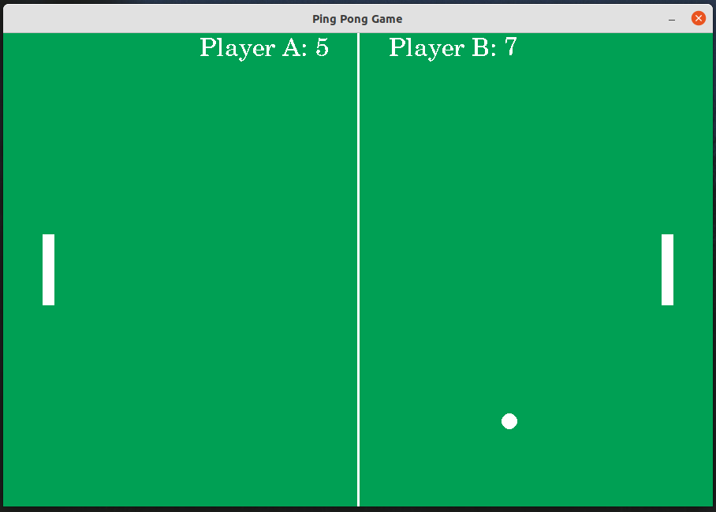

# Ping Pong Game

It's a very simple multiplayer ping pong game build on Pygame module where two persons can play this game. 

## Screenshot

## Controls
### For Player A:
    To move paddle up press 'w'
    To move paddle down press 's'

### For Player B:
    To move paddle up press 'UP_ARROW'
    To move paddle down press 'DOWN_ARROW'

## Dependencies: 
    * Python v3.x is required.
    * Pygame v2.x is required.
